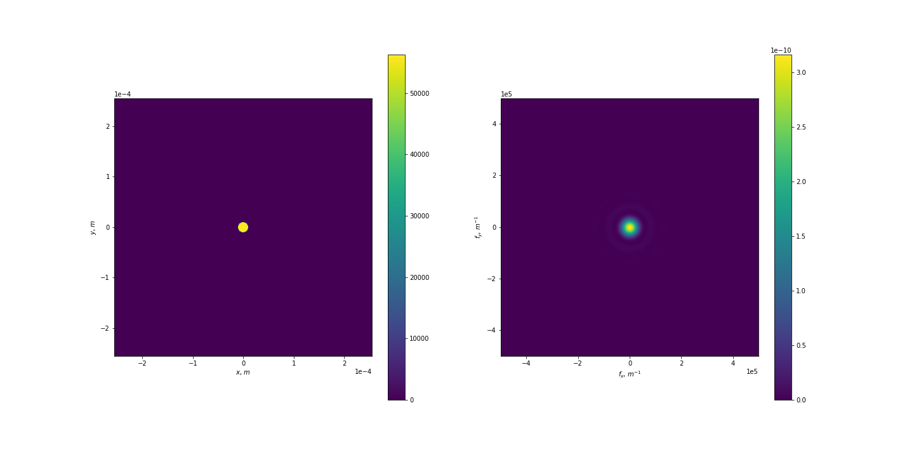
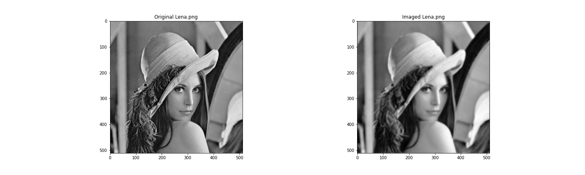
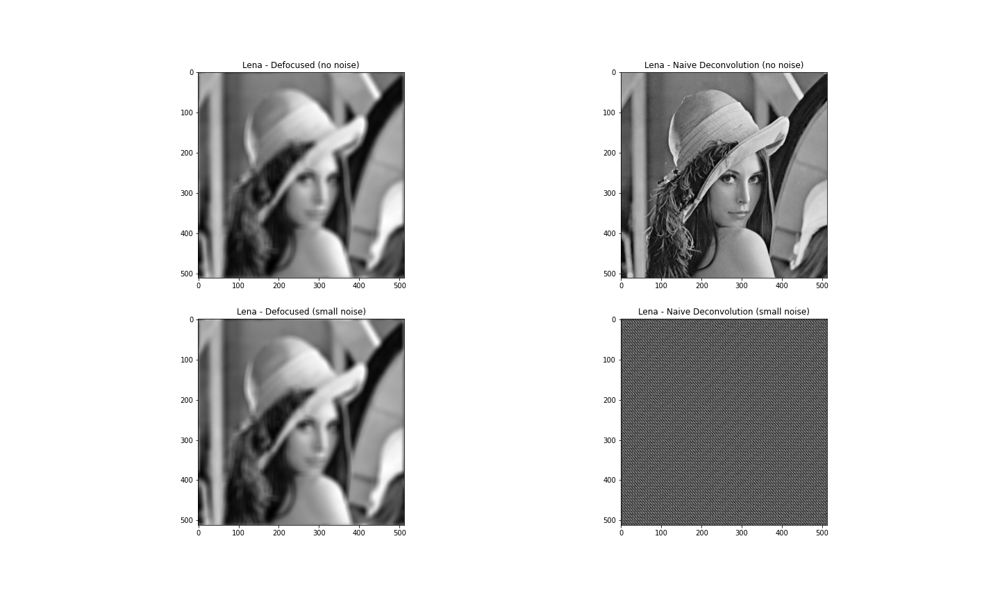
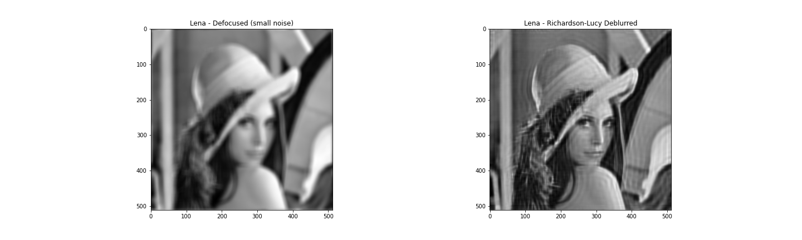
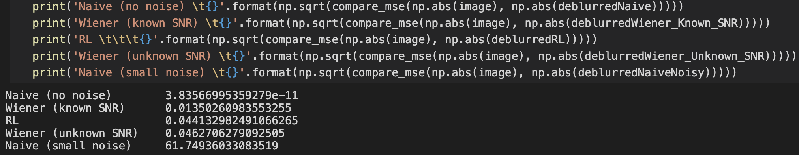

# 多媒体大作业报告


###### 班级：<u>信息学院1班</u> 	姓名：<u>方晓坤</u> 	学号：<u>2018202046</u> 	完成日期：<u>2020.6.24</u>


## 一、需求分析

本次实验，我们小组确定了“模糊照片修复”这一选题。根据小组分工，陈鹏宇负责对动态模糊进行处理，我负责对散焦产生的模糊进行处理。

## 二、详细设计

### 1、设计思路

在中期报告中，我们已经解释了失焦图片的产生原理——清晰图片与镜头的$\text{PSF}$做卷积的结果，所以我们需要做到模拟相机的孔径，构造相机的$\text{PSF}$，然后解卷积。如何解卷积也在中期报告中一并提及，不再赘述

至于解卷积有多处需要注意，因为实际情况下不只有与镜头的$\text{PSF}$做卷积的过程，最终成像还有外界的噪声影响。最初我们忽略了噪声直接解，结果解卷积的过程放大了噪声，使得最终得到的图片不可用

于是我们更新了解卷积的模型，引入了噪声与信号的比例$\text{(NSR)}$。这个模型已经有较广泛的使用，即$\text{Wiener Filter}$。在已知$\text{NSR}$的情况下，该方案表现良好。但是实际情况下，我们往往并不了解一张图片中噪声所占的比例，于是只好随便设一个固定值，这样得到的结果与前一个相比质量略有下降

最后我们尝试了$\text{Richardson-Lucy Algorithm}$。它神奇之处在于不需要知道噪声的比例，只需要迭代多次，就可以收敛到一个预测的图像。它的效果略好于未知$\text{NSR}$的$\text{Wiener Filter}$

### 2、具体设计

处理三通道图片和处理灰度图没有本质差别。因为$\text{RGB}$的每个通道都可以当作灰度单独抽取出来，处理完成后再合并，所以本次实验只通过处理模糊灰度图来进行演示

首先我们为了模拟镜头，需要创建一个孔径，在孔径内值不为$0$

```python
def createPupil(L, numPixels, pupilRadius):
    # 创建一个蒙版 在圆形光圈内为1 在外面为0
    W, H            = np.meshgrid(np.linspace(-L/2, L/2, num=numPixels), np.linspace(-L/2, L/2, num=numPixels))
    pupilMask       = np.sqrt(W**2 + H**2) <= pupilRadius

    pupil = pupilMask + 0j
    # 计算强度
    I_spatial = (np.abs(pupil)**2).sum()*dx*dx
    # 对其进行归一化
    pupil = pupil * np.sqrt(1 / I_spatial)
    
    return pupil
```

接下来是通过傅立叶变换，创建孔径的$\text{PSF}$

```python
def ft2(g, dx):
    G = fftshift(fft2(ifftshift(g))) * dx**2
    return G

def ift2(G, df):
    numPixels = G.shape[0]
    g = fftshift(ifft2(ifftshift(G))) * (df*numPixels)**2
    return g

# 做卷积
def conv2(g1, g2, dx):
    # 转到频域
    G1 = ft2(g1, dx)
    G2 = ft2(g2, dx)
    G_out = G1*G2

    numPixels = g1.shape[0]    
    # 转回空间域
    g_out = ift2(G_out, 1/(numPixels*dx))
    return g_out
  
# 通过傅立叶变换 创建孔径的PSF
csf = ft2(pupil, dx)  # 相干扩散函数
psf = np.abs(csf)**2  # 点扩散函数
```

我们绘制查看一下效果



通过以上的$\text{PSF}$成像的结果我们可以前后对比下




我们先用$\text{Naive Filter}$来处理模糊图像，它的原理和实现如下
$$
G(fx,fy) = Im(x,y) \otimes H(fx,fy) \\
Im(fx,fy) = G(fx,fy)  \otimes  \frac{1}{H(fx,fy)}
$$

```python
epsilon = 1e-4	# 防止出现/0的情况

def deconv2_eps(g1, g2, dx):
    # 转到频域
    G1 = ft2(g1, dx)
    G2 = ft2(g2, dx) + epsilon
    G_out = G1/G2 

    numPixels = g1.shape[0]    
    # 转回空间域
    g_out = ift2(G_out, 1/(numPixels*dx))
    return g_out

def conv2_eps(g1, g2, dx):
    # 转到频域
    G1 = ft2(g1, dx)
    G2 = ft2(g2, dx) + epsilon
    G_out = G1*G2

    numPixels = g1.shape[0]    
    # 转回空间域
    g_out = ift2(G_out, 1/(numPixels*dx))
    return g_out
```

分别实验加噪声前后的区别

```python
pupil = createPupil(L, numPixels, pupilRadius)
h = ft2(pupil * defocusTerm, dx)
blur_psf = np.abs(h)**2
# 模糊化
blurred = conv2_eps(image, blur_psf, df)
deblurredNaive = deconv2_eps(blurred, blur_psf, df)
# 加噪声
noise_std = 1e-4
noise = np.random.normal(0, noise_std, image.shape)
blurredNoisy = blurred + noise
deblurredNaiveNoisy = deconv2_eps(blurredNoisy, blur_psf, df)

fig = plt.figure(figsize=(20, 12))
fig.add_subplot(221)
ax = plt.imshow(np.abs(blurred), cmap='gray')
plt.title("Lena - Defocused (no noise)")

fig.add_subplot(222)
ax = plt.imshow(np.abs(deblurredNaive), cmap='gray')
plt.title("Lena - Naive Deconvolution (no noise)")

fig.add_subplot(223)
ax = plt.imshow(np.abs(blurredNoisy), cmap='gray')
plt.title("Lena - Defocused (small noise)")

fig.add_subplot(224)
ax = plt.imshow(np.abs(deblurredNaiveNoisy), cmap='gray')
plt.title("Lena - Naive Deconvolution (small noise)")

fig.savefig('imgs/naive_noisy_comparison.png')
```

可以发现如果没有噪声，图像被几乎完美地还原了。但是添加噪声后，复原的图像完全看不到原来的细节



这里我们更换模型，换用$\text{Wiener Filter}$
$$
\begin{aligned}
W(f) & = \frac{1}{H(f)} \left[ \frac{ |H(f)|^2 }{ |H(f)|^2 + \frac{N(f)}{S(f)} } \right] \\
      & = \frac{1}{H(f)} \left[ \frac{ |H(f)|^2 }{ |H(f)|^2 + \frac{1}{\mathrm{SNR}(f)}} \right]
\end{aligned}
$$

```python
def wiener2(blurredNoisy, blur_psf, dx, NSR):
    G1 = ft2(blurredNoisy, dx)
    G2 = ft2(blur_psf, dx)

    G_out = G1 * (1/G2)*(np.abs(G2)**2)/((np.abs(G2)**2) + NSR)
    deblurred = ift2(G_out, 1/(numPixels*dx))
    return deblurred
```

我们需要在添加噪声时确定噪声所占的比例

```python
# 模糊化
blurred = conv2_eps(image, blur_psf, df)
# 加噪声
noise_std = 1e-4
noise = np.random.normal(0, noise_std, image.shape)
blurredNoisy = blurred + noise
# 确定NSR
Pnn = np.abs(fftshift(fft2(noise)))**2
Pss = np.abs(fftshift(fft2(image)))**2
NSR = Pnn/Pss
```

同样我们打印图片查看结果

```python
deblurredWiener_Known_SNR = wiener2(blurredNoisy, blur_psf, df, NSR)
deblurredWiener_Unknown_SNR = wiener2(blurredNoisy, blur_psf, df, 1e-2)

fig = plt.figure(figsize=(20,12))
fig.add_subplot(221)
ax = plt.imshow(np.abs(blurredNoisy), cmap='gray')
plt.title("Lena - Defocused (small noise)")

fig.add_subplot(222)
ax = plt.imshow(np.abs(deblurredWiener_Known_SNR), cmap='gray')
plt.title("Lena - Wiener Deconvolution (known SNR)")

fig.add_subplot(223)
ax = plt.imshow(np.abs(blurredNoisy), cmap='gray')
plt.title("Lena - Defocused (small noise)")

fig.add_subplot(224)
ax = plt.imshow(np.abs(deblurredWiener_Unknown_SNR), cmap='gray')
plt.title("Lena - Wiener Deconvolution (unknown SNR)")

fig.savefig('imgs/wiener_comparison.png')
```

可以看到如果已知$\text{NSR}$，效果非常好，如果未知的话，效果稍逊一筹


最后我们采用$\text{Richardson-Lucy Algorithm}$
$$
f_{(k+1)} = f_{(k)}.H^T * \frac{g}{H * f_{(k)}}
$$

```python
def richardsonLucy(img, psf, iterations=100):
    f = img
    blur_psf = np.matrix(psf)
    psf_mirror = blur_psf.T

    for _ in range(iterations):
        f = f * conv2(img / conv2(f, blur_psf, df), psf_mirror, df)
    
    return f
```

```python
# 模糊化
blurred = conv2_eps(image, psf, df)
# 加噪声
poisson_val = 1e-8
blurredNoisy = np.random.poisson(np.abs(blurred) / poisson_val) * poisson_val
# RL
deblurredRL = richardsonLucy(blurredNoisy, psf, iterations=100)
```

```python
fig = plt.figure(figsize=(20,6))
fig.add_subplot(121)
ax = plt.imshow(np.abs(blurredNoisy), cmap='gray')
plt.title("Lena - Defocused (small noise)")

fig.add_subplot(122)
ax = plt.imshow(np.abs(deblurredRL), cmap='gray')
plt.title("Lena - Richardson-Lucy Deblurred")

fig.savefig('imgs/LR_comparison.png')
```

结果如下




## 三、结果分析

我们通过均方误差比较原图像和处理后图像的差别，得到的值越小，则还原效果越好



所以在本次实验下，我们得到了如下结论
$$
\text{Naive (no noise)}>\text{Wiener (known SNR)}>\text{RL}>\text{Wiener (unknown SNR)}>\text{Naive (small noise)}
$$
